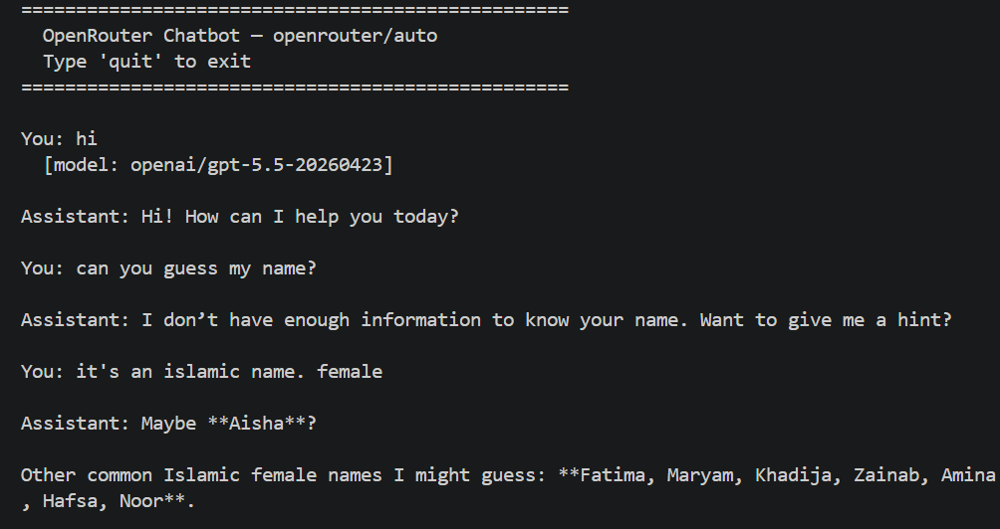
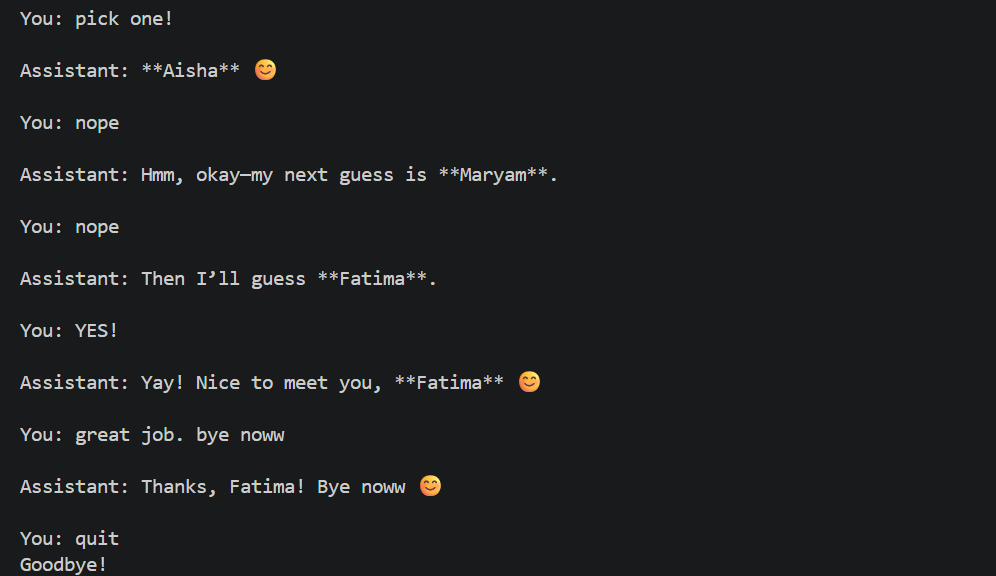

# OpenRouter Terminal Chatbot

A simple multi-turn terminal chatbot built with Python and OpenRouter's free LLM API.  

---

## What It Does

- Connects to OpenRouter's free LLM models via a single API key
- Maintains multi-turn conversation context (the model remembers what you said earlier in the session)
- Displays which model OpenRouter actually selected on the first response
- Handles errors gracefully — failed messages are removed from context so conversation stays clean

---

## Prerequisites

- Python 3.10+
- An OpenRouter account and API key → [openrouter.ai/keys](https://openrouter.ai/keys) (free, no credit card required)

---

## Setup

### 1. Clone the repo

```bash
git clone https://github.com/Fatima-Siddiqa/chatbot.git
cd chatbot
```

### 2. Create and activate a virtual environment

```bash
python -m venv venv
venv\Scripts\activate        # Windows
source venv/bin/activate     # Mac/Linux
```

### 3. Install dependencies

```bash
pip install -r requirements.txt
```

### 4. Configure your API key

Copy `.env.example` to `.env`:

```bash
copy .env.example .env      # Windows
cp .env.example .env        # Mac/Linux
```

Open `.env` and fill in your key:

```env
OPENROUTER_API_KEY=sk-or-v1-your-key-here
OPENROUTER_BASE_URL=https://openrouter.ai/api/v1/chat/completions
OPENROUTER_MODEL=openrouter/auto
```

> `openrouter/auto` lets OpenRouter pick the best available free model automatically. You can replace it with any specific model ID from [openrouter.ai/models](https://openrouter.ai/models) — free models end in `:free`.

---

## Run

```bash
python chatbot.py
```

Type your messages and press Enter. Type `quit` to exit.

---

## Example





---

## Project Structure

```
chatbot/
├── chatbot.py        # main chatbot script
├── requirements.txt  # dependencies
├── .env              # your API key (not committed)
├── .env.example      # template for .env
├── .gitignore        # excludes .env and venv
└── screenshots/
    ├── image1.png
    └── image2.png
```

---

## How It Works

Every message you send is added to a growing `history` list which is re-sent to the API on every request. This is how the model "remembers" the conversation — it has no memory of its own, you send the full context each time.

```
[system prompt, user msg 1, assistant reply 1, user msg 2, assistant reply 2, ...]
                                                            ↑ sent again every turn
```

If a request fails (rate limit, network error), the unanswered user message is removed from history so context stays consistent.

---

## .env Reference

| Variable | Required | Description |
|---|---|---|
| `OPENROUTER_API_KEY` | ✅ | Your OpenRouter API key |
| `OPENROUTER_BASE_URL` | optional | Defaults to OpenRouter chat completions endpoint |
| `OPENROUTER_MODEL` | optional | Model ID to use. Defaults to `meta-llama/llama-3.3-70b:free` |